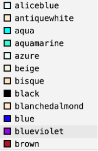

# Cores no CSS

## Cores por nome

Essa é a forma mais básica de utilizar cores no CSS. Cada cor é representada por um nome em inglês. Segue um exemplo e a lista completa abaixo de cores que podem ser utilizadas desse forma:

Fonte: https://github.com/gustavoguanabara/html-css

Entretanto essa forma é muito limitada, já que existem muitas cores além dessas e existem também muitas variações possíveis de tons de cores.

## Cores por códigos hexadecimais

Uma forma mais comum de utilizar cores no CSS é através de códigos hexadecimais. Dessa forma cada cor do espectro é presentada por um código que inicia com # e contém 6 caracteres que variam de letras do alfabeto latino e número de 0 a 9. Com essa forma de representar as cores é possível utilizar praticamente todas as cores do espectro.

## Cores por rgb

O código RGB está baseado nas cores primárias. Ele consiste de três números indicando a "quantidade" de vermelho, verde e azul nessa ordem. Essa quantidade varia de 0 a 255 e cada variação nessa quantidade produz uma cor diferente. Aqui também é possível representar praticamente qualquer cor do espectro.

Essas são as principais formas de usar cores no CSS, no entanto existem outras.