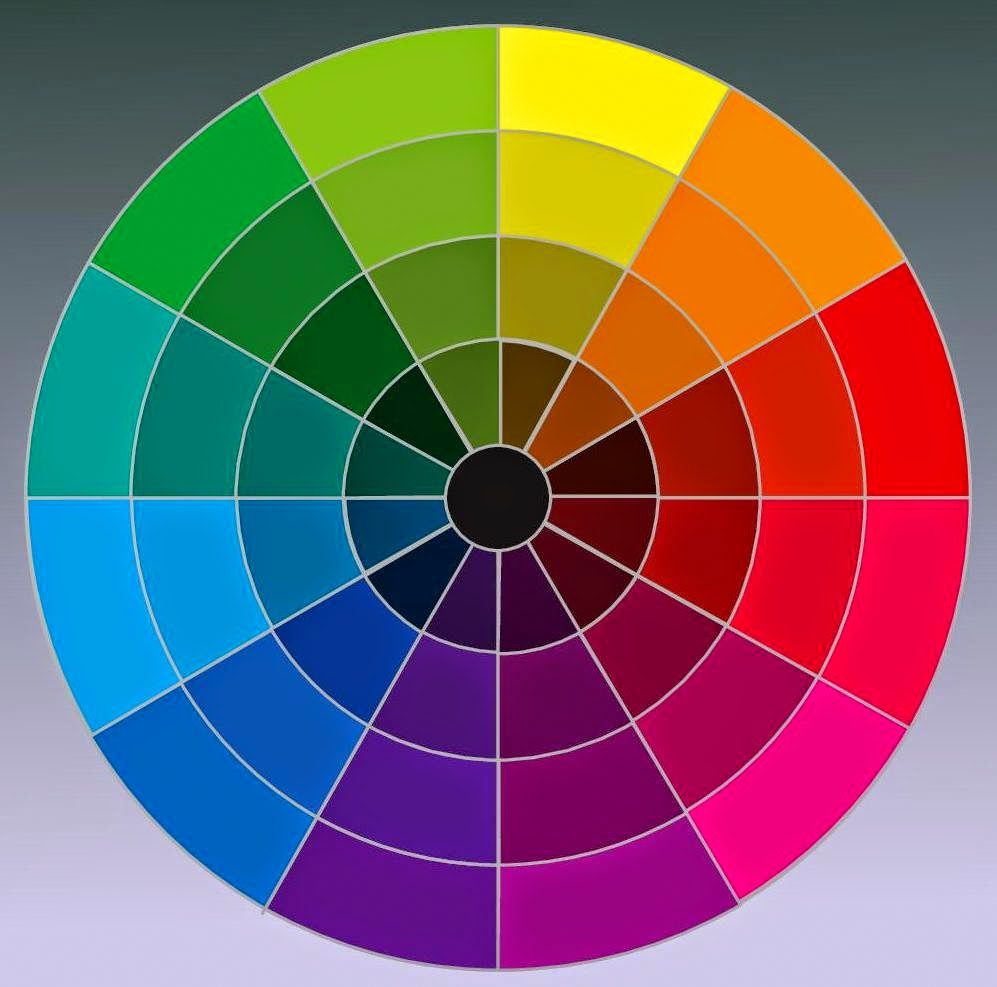

# Psicologia das Cores

## As cores impactam positivamente ou negativamente os seres humanos
A psicologia das cores é um ramo de estudos que busca associar determinados comportamentos humanos e emoções a exposição de determinadas cores. Além disso variações dessas cores também está associado a varições de comportamentos e emoções. Assim , quando se pensa em design um dos primeiros pontos a se considerar são as cores que serão utilizadas. A decisão das cores que serão usadas no projeto não é então arbitrária. Na verdade além de levar em consideração os efeitos psicológicos de cada cor é preciso entender como se dá a harmonia entre as mais variadas cores e seus tons.

## Harmonia das Cores

Para entender bem a harmonia que existe entre as cores é necessário entender como elas são dispostas em um diagrama chamado círculo cromático. Veja abaixo:

Nós temos 12 cores principais que compõe o círculo cromático, são 3 cores primárias: vermelho, amarelo e azul. 3 Cores secundárias: Verde, laranja e violeta. E seis cores terciárias: amarelo-esverdeado, amarelo-alaranjado, vermelho-alaranjado, vermelho-arroxeado, azul-arroxeado, Azul-esverdeado. As cores secundárias surgem das combinações entre as cores primárias e as terciárias das combinações entre as primárias e as secundárias.

Muitos *esquemas harmônicos* são definidos com base nesse diagrama. Por exemplo a técnica da monocromia, que consiste em escolher uma única cor do círculo e utilizar apenas ela e suas variações criando assim um design degradê. Outra técnica interessante é utilizar dois pares de cores complementares. Cores complementares são cores opostas no círculo. Existem muitas técnicas possíveis.

## Paleta de cores

Após determinado o tipo de esquema harmônico a ser utilizado e as cores que iram compô-lo nós temos o que se chama de paleta de cores do projeto. Um site muito interessante para criar paleta de cores é o color.adobe.com. Lá também é possível escolher entre paleta de cores já criadas.