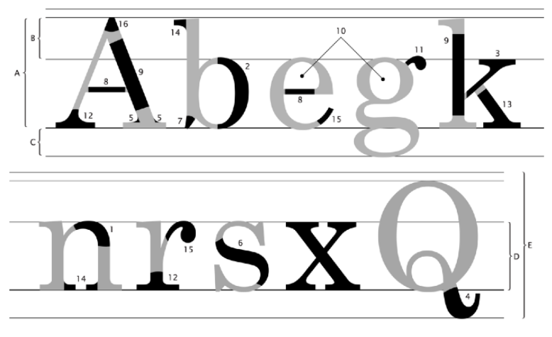

# Introdução a Tipografia

## O que é?

Tipografia consiste no estudo de como representar as letras. E isso importa pois cada fonte, ou seja, cada forma de representar as letras passa um sentimento diferente em quem lê. É parecido com o caso da psicologia das cores, aqui cada fonte também pode ser mais conveniente a depender sobre o que queremos escrever e o contexto.

## Conceitos importantes

1. Glifos ou caracteres: São os *símbolos gráficos* que representam as letras.
2. Família Tipográfica: É um conjunto de caracteres que apresentam as mesmas características anatômicas, independente de suas varições.
3. Fonte: Compreende o conjunto de todos os glifos necessários a uma família tipográfica.

## Legibilidade e Leiturabilidade

Na prática, quando vamos determinar as fontes para um projeto web ou qualquer outro tipo de projeto devemos levar em consideração a *legibilidade* e a *leiturabilidade* das fontes. Muitas fontes que tem características anatômicas que fogem do padrão, são as fontes mais decoradas vamos dizer assim, podem ser úteis para se usar em algumas palavras ou frases em situações específicas, mas no geral essas fontes possuem baixa leiturabilidade o que significa que não servem para texto corrido.

Assim, devemos escolher duas ou três fontes no máximo para cada projeto e tomar cuidado na escolha da fonte usada no texto corrido, abaixo vamos entender melhor as características anatômicas que aumentar a leiturabilidade de uma fonte.

## Características anatômicas

Fonte: https://github.com/gustavoguanabara/html-css

- A - Altura das maiúsculas: Altura que as letras maiúsculas vão ocupar. Geralmente um pouco menor que a soma da ascendente com a mediana (< B + D).
- B - Ascendente: Parte das letras maiúsculas que se ergue acima da linha mediana.
- C - Descendente: Parte das letras minúsculas que passa por baixo da linha de base.
- D - Altura-X: Também chamada de mediana, define o tamanho das letra minúsculas. Tem esse nome, pois se baseia no tamanho da letra x minúscula.
- E - Corpo: É a soma de quatro medidas: ascendente + altura-x + descendente + espaço de reserva. É o tamanho total da letra. É o valor que escolhemos ao configurar o tamanho da fonte em um texto.

1. Arco: presente em letras minúsculas. Uma linha curva que nasce em na haste principal.
2. Barriga: curva em uma letra maiúscula ou minúscula, fechada, ligada à haste vertical em dois pontos.
3. Braço: traço horizontal ou inclinado, ligado à haste vertical principal de uma letra maiúscula ou minúscula.
4. Cauda: apêndice do corpo de algumas letras (g, j, J, K, Q, R), que fica abaixo da linha base.
5. Enlace: a forma como uma haste, linha ou filete se liga a um arremate, a uma serifa ou a um terminal. Pode ser angular ou curvilíneo.
6. Espinha: curva e contracurva estrutural da letra S.
7. Esporão: uma projeção que encontramos nas letras b e G.
8. Filete: haste horizontal ou inclinada, fechada nas duas extremidades, por duas hastes ou por uma curva.
9. Haste: traço principal de uma letra, geralmente vertical.
10. Olho: espaço em branco, fechado, dentro de uma letra.
11. Orelha: apêndice presente na letra g, que pode ser em gota, botão, bandeira ou gancho.
12. Pé: terminal ou serifa horizontal que arremata uma perna na parte de baixo.
13. Perna: haste vertical ou inclinada com um extremidade livre (ou com um pé) e outra extremidade ligada ao corpo da letra.
14. Serifa: também chamada de apoio ou patilha. Pequenas retas que ornamentam as hastes de alguns tipos.
15. Terminal: forma que arremata a extremidade de uma linha curva de uma letra.
16. Vértice: também chamada de ápice. Formada pela convergência de duas hastes que se encontram. Pode ser pontiagudo, oblíquo, plano ou redondo.

## Categorias de Fontes

### Fontes Serifadas

As fontes que possuem serifas foram justamente os primeiros tipos de fontes criadas. Quando se trata de leiturabilidade no papel elas são as fontes mais indicadas, para a web o padrão é outro.

### Fontes não Serifadas

Essas aqui vieram um tempo depois das serifadas e são conhecidas hoje em dia como *sans-serif* (que significa "sem serifa" em francês). É justamente esse tipo de fonte que é indicada para conteúdo na web pois aumenta a ideia de clareza e organização.

### Fontes Monoespaçadas

As fontes monoespaçadas possuem a característica principal de que cada glifo tem a mesma largura, ou seja, ocupa o mesmo espaço lateral na tela ou no papel. A utilização desse tipo de fonte é mais comum em consoles e terminais de computadores.

### Fontes de Script

São fontes que tentam imitar a escrita humana, possuem um nível de leiturabilidade muito baixa.

### Fontes display

São todas as fontes que não se encaixam em nenhum das classificações acima, são basicamente as fontes com um nível de decoração dos glifos muito maior. São fontes ideais para títulos chamativos. 